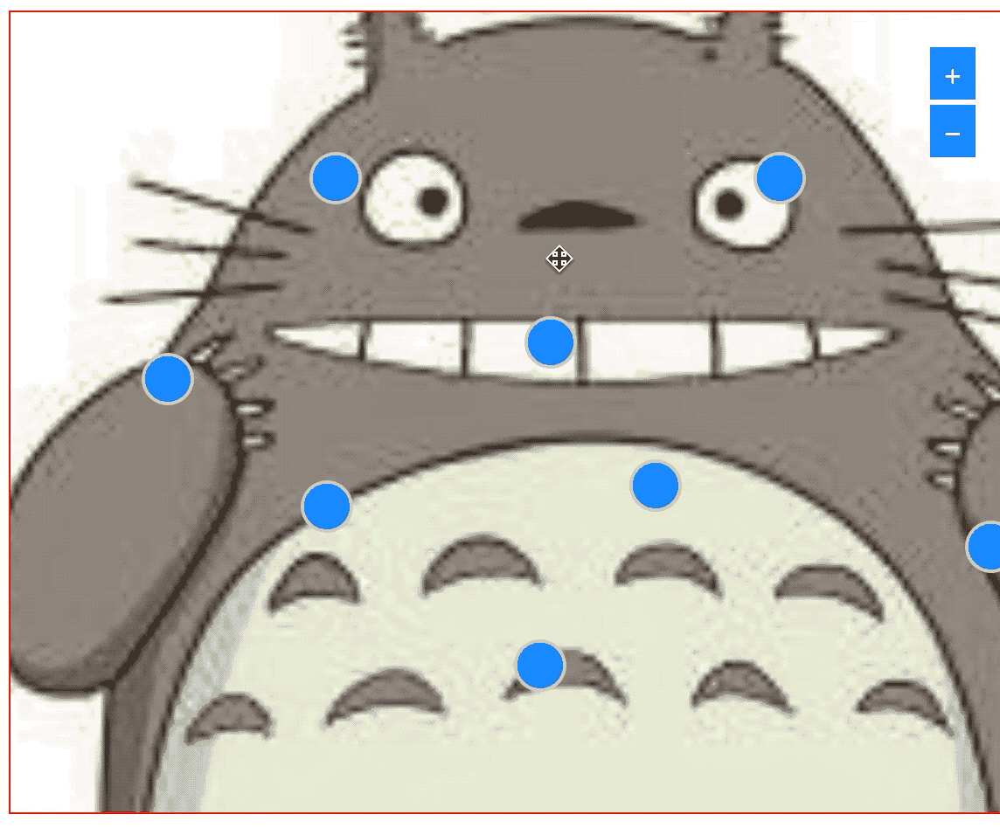

# react-drag-dom

> React draggable component

[](https://www.npmjs.com/package/react-drag-dom) [](https://standardjs.com)

## Application
When you are asked to set a point on a scalable graph, ues it. in this components, Coordinates are in percent

## Install

```bash
npm install --save react-drag-dom
```

## Usage

```tsx
import * as React from 'react'

import Dragger, { DragFrame } from 'react-drag-dom'

const Example = () => {
  
  const onStop = (e, data, cb) => {
    console.log(e, data)
  }
  const batchSelect = (e, start, end, offsetP, cb) => {}

  return (
    <div
      style={{
        backgroundImage: `url(${bgImg})`,
        position: 'relative',
      }}>
      <Dragger
        onStop={onStop}
      >
        <div
          style={{
            position: "absolute",
            left: point.x + "%",
            top: point.y + "%",
            width: "1px",
            height: "1px"
          }}
        >
          <Icon />
        </div>
      </Dragger>
      {show && <DragFrame onDrawStop={batchSelect}>}
    </div>
  )
}
```

## Dragger
Property | Description | 	Type | Default
-------- | ----------- |  ---- | -------
disabled | forbid drag | boolean | false
bounds | boundaries of movement，go beyond will trigger `triggerBounds` | ReactNode | --
triggerBounds | triggered when out of boundaries | ({x, y}) => {x, Y} | --
offsetParent | assign relative position element | ReactNode
onStart | drag start | function | --
onDrag | -- | function | --
onStop | -- | function | --
onClick | -- | function | --

## DragFrame
Property | Description | Type | Default
-------- | ----------- | ---- | -------
offsetParent | assign relative position element | ReactNode
bounds | boundaries of movement，go beyond will trigger `triggerBounds` | ReactNode | --
triggerBounds | triggered when out of boundaries | ({x, y}) => {x, Y} | --
zoomAble | if resize selected areas | boolean | false
onDrawStart | draw start | function | --
onDraw | drawing | function | --
onDrawStop | draw end | function | --
onCancel | complete select | function | --

## demo


## License

MIT © [alowkeyguy](https://github.com/alowkeyguy)
